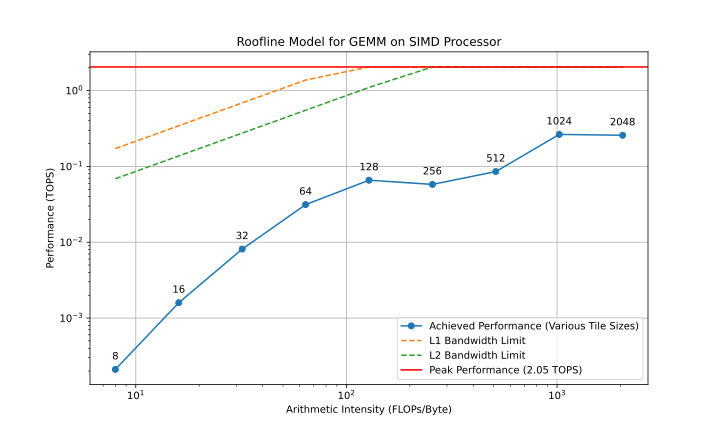

# Simplistic roof line model analysis for hypothetical processor config
This tool will perform simple performance analysis of GEMM on a hypothetical
processor and plot a chart.

Example output from the example values:



```
Theoretical Peak Performance: 2.05 TOPS

Roofline Data:
  Tile Size: 8
    Achieved Performance: 0.00 TOPS
    Arithmetic Intensity: 8.00 FLOPs/Byte
    L1 Cache Miss Estimate: False
    L2 Cache Miss Estimate: False
    L1 Bandwidth Limit: 0.17 TOPS
    L2 Bandwidth Limit: 0.07 TOPS
------------------------------
  Tile Size: 16
    Achieved Performance: 0.00 TOPS
    Arithmetic Intensity: 16.00 FLOPs/Byte
    L1 Cache Miss Estimate: False
    L2 Cache Miss Estimate: False
    L1 Bandwidth Limit: 0.34 TOPS
    L2 Bandwidth Limit: 0.14 TOPS
------------------------------
  Tile Size: 32
    Achieved Performance: 0.01 TOPS
    Arithmetic Intensity: 32.00 FLOPs/Byte
    L1 Cache Miss Estimate: False
    L2 Cache Miss Estimate: False
    L1 Bandwidth Limit: 0.69 TOPS
    L2 Bandwidth Limit: 0.27 TOPS
------------------------------
  Tile Size: 64
    Achieved Performance: 0.03 TOPS
    Arithmetic Intensity: 64.00 FLOPs/Byte
    L1 Cache Miss Estimate: False
    L2 Cache Miss Estimate: False
    L1 Bandwidth Limit: 1.37 TOPS
    L2 Bandwidth Limit: 0.55 TOPS
------------------------------
  Tile Size: 128
    Achieved Performance: 0.07 TOPS
    Arithmetic Intensity: 128.00 FLOPs/Byte
    L1 Cache Miss Estimate: False
    L2 Cache Miss Estimate: False
    L1 Bandwidth Limit: 2.05 TOPS
    L2 Bandwidth Limit: 1.10 TOPS
------------------------------
  Tile Size: 256
    Achieved Performance: 0.06 TOPS
    Arithmetic Intensity: 256.00 FLOPs/Byte
    L1 Cache Miss Estimate: False
    L2 Cache Miss Estimate: False
    L1 Bandwidth Limit: 2.05 TOPS
    L2 Bandwidth Limit: 2.05 TOPS
------------------------------
  Tile Size: 512
    Achieved Performance: 0.09 TOPS
    Arithmetic Intensity: 512.00 FLOPs/Byte
    L1 Cache Miss Estimate: False
    L2 Cache Miss Estimate: False
    L1 Bandwidth Limit: 2.05 TOPS
    L2 Bandwidth Limit: 2.05 TOPS
------------------------------
  Tile Size: 1024
    Achieved Performance: 0.26 TOPS
    Arithmetic Intensity: 1024.00 FLOPs/Byte
    L1 Cache Miss Estimate: True
    L2 Cache Miss Estimate: True
    L1 Bandwidth Limit: 2.05 TOPS
    L2 Bandwidth Limit: 2.05 TOPS
------------------------------
  Tile Size: 2048
    Achieved Performance: 0.26 TOPS
    Arithmetic Intensity: 2048.00 FLOPs/Byte
    L1 Cache Miss Estimate: True
    L2 Cache Miss Estimate: True
    L1 Bandwidth Limit: 2.05 TOPS
    L2 Bandwidth Limit: 2.05 TOPS
------------------------------
```